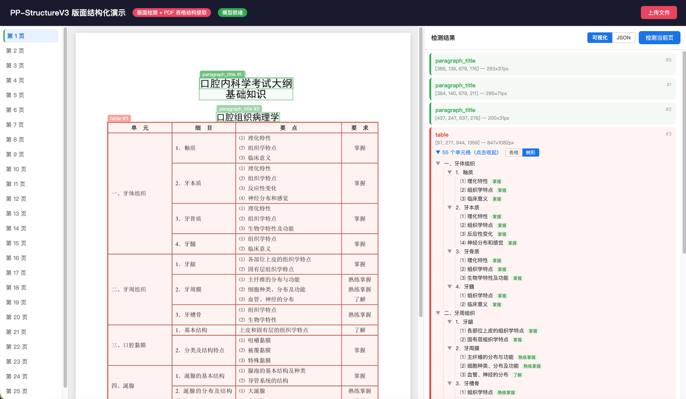

# PP-StructureV3 Demo

PDF 文档版面结构化分析工具。上传 PDF 后自动检测版面区域，提取标题、表格、正文等结构化内容，输出干净的 JSON 数据。

**智能双通道**：文本型 PDF 直接提取（快速精准），扫描件 PDF 自动走 OCR + 表格结构识别。



## 功能

### 版面检测
- 使用 [PP-DocLayoutV3](https://huggingface.co/PaddlePaddle/PP-DocLayoutV3_safetensors) 模型，识别标题、表格、文本、公式等区域
- 首次启动自动下载模型并保存到项目 `model/` 目录，之后离线可用

### 文本提取（双通道）
- **文本型 PDF**：PyMuPDF 直接提取文字层（毫秒级）
- **扫描件 PDF**：PP-OCRv5 ONNX 自动识别（GPU 用 server 版，CPU 用 mobile 版）
- 逐页智能判断，混合 PDF 也能正确处理

### 表格结构
- **文本型 PDF**：PyMuPDF 提取单元格级结构（行、列、合并单元格、文字内容）
- **扫描件 PDF**：RapidTable (SLANet_plus) 识别表格行列结构，输出 HTML 表格
- 表格支持「网格」和「树形」两种可视化视图

### 目录解析
- 自动识别目录页，拆分标题和页码
- 引导线（省略号）自动去除
- 分离的页码行自动合并回标题

### 可视化校对
- 双向联动：点击右侧结果 ↔ 图片对应区域高亮定位
- 所有区域直接显示提取到的文字内容
- 扫描件表格渲染 HTML 表格视图
- 结果缓存到 localStorage，刷新不丢失
- 右侧面板宽度可拖动调整

### 结构化 JSON 输出
- `title`：标题文字，按行拆分去重
- `table`：表头 + 行数据，合并单元格自动继承，多行值拆为数组
- `table_html`：扫描件表格 HTML 结构
- `toc`：目录条目，标题 + 页码分离
- `text`：正文段落

## 技术栈

| 组件 | 技术 |
|------|------|
| 版面检测 | [PP-DocLayoutV3](https://huggingface.co/PaddlePaddle/PP-DocLayoutV3_safetensors) (transformers + PyTorch) |
| OCR 引擎 | [PP-OCRv5](https://github.com/PaddlePaddle/PaddleOCR) ONNX (onnxruntime) |
| 表格结构识别 | [RapidTable](https://github.com/RapidAI/RapidTable) (SLANet_plus ONNX) |
| PDF 处理 | PyMuPDF（渲染 + 文字提取 + 表格提取）|
| 后端 | FastAPI |
| 前端 | 单文件 HTML（原生 JS，无框架依赖）|

## 快速开始

```bash
# 创建虚拟环境（需要 Python 3.11）
python3.11 -m venv .venv
source .venv/bin/activate

# 安装依赖
pip install -r requirements.txt

# 启动
python server.py
```

访问 http://localhost:3001

首次启动会自动下载模型（版面检测 ~127MB + OCR ~164MB），页面顶部显示加载状态。

### 国内用户加速下载

```bash
export HF_ENDPOINT=https://hf-mirror.com
python server.py
```

### GPU 加速

有 NVIDIA GPU 时自动启用：
- 版面检测模型加载到 GPU
- OCR 自动切换为 server 版（精度更高）
- 安装 GPU 版 onnxruntime：`pip install onnxruntime-gpu`

## 结构化输出示例

```json
{
  "page": 1,
  "content": [
    { "type": "title", "text": "口腔内科学考试大纲" },
    { "type": "title", "text": "基础知识" },
    {
      "type": "table",
      "headers": ["单元", "细目", "要点", "要求"],
      "rows": [
        {
          "单元": "一、牙体组织",
          "细目": "1．釉质",
          "要点": ["⑴ 理化特性", "⑵ 组织学特点", "⑶ 临床意义"],
          "要求": "掌握"
        }
      ]
    },
    {
      "type": "toc",
      "items": [
        { "title": "第一章 牙体组织", "page": 1 },
        { "title": "第二节 牙周膜", "page": 8 }
      ]
    }
  ]
}
```

## 项目结构

```
├── server.py           # FastAPI 后端（版面检测 + 文本提取 + 结构化输出）
├── index.html          # 单文件前端（上传 + 可视化 + 双向联动）
├── ppocr5.py           # PP-OCRv5 ONNX 推理引擎
├── requirements.txt    # Python 依赖
├── model/              # 版面检测模型（首次启动自动下载）
│   └── ocr/            # OCR 模型（首次启动自动下载）
└── .gitignore
```
